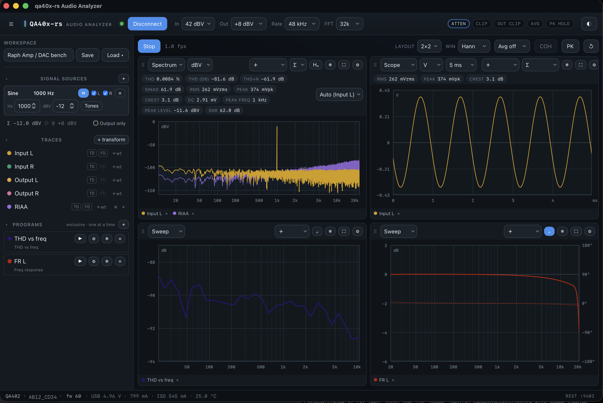

# qa40x-rs Audio Analyzer

A desktop app for controlling and measuring with the **QuantAsylum
QA402 / QA403** audio analyzers — written in Rust.



More screenshots (sources, scripting, live spectrum) in
[`doc/screenshots/`](doc/screenshots/).

This is a **personal project**. It is not meant to replace the official
QuantAsylum application, which remains the reference in any case — please
use it. The main goals here were:

- a **native macOS app**, simple to install and to use — and cross-platform
  where possible;
- **learning** about audio analysis and measurement along the way.

Feature-wise, the app currently sits somewhere between the official
application **v1** and the upcoming **v2** expected in 2026.

> **Unofficial project.** Not affiliated with, authorized, or endorsed by
> QuantAsylum. "QA402", "QA403" and "QuantAsylum" are trademarks of their
> respective owners. This is an implementation of the device protocol and
> measurement UI, named `qa40x-rs` to avoid any confusion with the official
> software.

> **Developed with AI assistance.** This software was written almost entirely
> with the help of AI coding tools. It has been reviewed and tested as
> carefully as I could manage, but despite that effort some mistakes may well
> have slipped through — in the code, the measurements, or the documentation.
> Treat the numbers critically, cross-check anything that matters against the
> official application, and please [report](https://github.com/GarageDeveloper/qa40x-rs/issues)
> anything that looks wrong. The software comes with no warranty (see the
> [license](#license)).

---

## Features

- **Live views** — spectrum, oscilloscope and swept measurements in a
  configurable multi-tile grid; any trace can be frozen and kept as a
  reference for comparison.
- **Measurements** — THD, THD+N, SNR, RMS and peak levels (dBV), crest
  factor; input-attenuator status surfaced in the UI.
- **Frequency response** — swept (log-chirp) measurement with
  fractional-octave smoothing.
- **Signal generation** — backend-mixed multi-source generator: sine,
  square, multitone mixes, script-defined sources; output-only mode for
  driving external gear.
- **Weighting** — A/C curves, inverse RIAA for phono work, user-loadable
  custom curves.
- **Workspaces** — the whole session (layout, sources, traces, settings) can
  be saved and restored as named workspaces.
- **Automation** — a QA40x-compatible REST API (localhost by default,
  bearer-token protected when exposed to the network) and in-app scripting
  (Rhai) for measurement sequences.
- **Device panel** — live telemetry (USB voltage/current, temperature),
  firmware version and serial at connect.
- **Demo mode** — a **Demo** button next to Connect attaches a built-in
  virtual QA403 (the [virtual-qa40x-rs](https://github.com/GarageDeveloper/virtual-qa40x-rs)
  device model, embedded in-process): no hardware, nothing extra to
  download. The whole app runs on it — simulated DAC→ADC loopback with a
  realistic noise floor and mild harmonic distortion, a real factory
  calibration page, live telemetry, REST and scripting included. Sessions
  are badged **DEMO** so a demo screen can never pass for a measurement,
  and plugging a real unit in mid-demo hands the session over to it
  automatically.
- **Firmware tools** *(advanced, opt-in — see the warning below)* — extract
  official firmware from a QuantAsylum installer you already own, verify it
  against a known-hash registry and its cryptographic signature, and flash it.

---

## Install

> **No QA40x at hand?** You can still try everything: click **Demo** (next to
> Connect) and the app attaches a built-in virtual QA403 — spectrum, THD,
> sweeps, generator, REST and scripting all work against a simulated,
> calibrated loopback. Nothing extra to download. The session is badged
> **DEMO**, and the moment you plug a real unit in, the app switches over to
> it automatically.

### Prebuilt apps

Latest release (all platforms and older versions) on the
[**Releases** page](https://github.com/GarageDeveloper/qa40x-rs/releases/latest).
Direct downloads for the current version:

- **macOS (Apple Silicon)** —
  [`qa40x-rs Audio Analyzer_0.2.1_aarch64.dmg`](https://github.com/GarageDeveloper/qa40x-rs/releases/download/v0.2.1/qa40x-rs.Audio.Analyzer_0.2.1_aarch64.dmg):
  drag the app onto Applications. Release builds are signed with a Developer ID
  and notarized by Apple, so they open with no Gatekeeper warning.
- **macOS (Intel, legacy)** —
  [`qa40x-rs Audio Analyzer_0.2.1_x86_64-legacy.dmg`](https://github.com/GarageDeveloper/qa40x-rs/releases/download/v0.2.1/qa40x-rs.Audio.Analyzer_0.2.1_x86_64-legacy.dmg):
  same signed + notarized build for older Intel Macs. Provided for the shrinking
  Intel-Mac base and expected to be retired within a year or two.
- **Linux** — `.deb` / `.rpm` (both install the USB udev rule and reload udev
  automatically) or AppImage (needs the manual udev rule below).
- **Windows** — installer built per release.

### Build from source

**Prerequisites:** [Rust](https://rustup.rs) (stable) and
[Node.js](https://nodejs.org) 18+.

Platform system dependencies:

- **macOS** — none beyond Xcode command-line tools.
- **Linux (Debian/Ubuntu)**
  ```bash
  sudo apt-get update && sudo apt-get install -y \
    libwebkit2gtk-4.1-dev libappindicator3-dev librsvg2-dev \
    libgtk-3-dev libssl-dev libudev-dev patchelf
  ```
  USB access (udev rule) — the `.deb` / `.rpm` packages install
  `/usr/lib/udev/rules.d/99-qa40x.rules` and reload udev automatically.
  Only for the AppImage or a from-source build, create
  `/etc/udev/rules.d/99-qa40x.rules` yourself:
  ```
  SUBSYSTEM=="usb", ATTR{idVendor}=="16c0", ATTR{idProduct}=="4e37", MODE="0666"
  SUBSYSTEM=="usb", ATTR{idVendor}=="16c0", ATTR{idProduct}=="4e39", MODE="0666"
  # NXP bootloader (firmware flashing)
  SUBSYSTEM=="usb", ATTR{idVendor}=="1fc9", ATTR{idProduct}=="0022", MODE="0666"
  KERNEL=="hidraw*", ATTRS{idVendor}=="1fc9", ATTRS{idProduct}=="0022", MODE="0666"
  ```
  then `sudo udevadm control --reload-rules && sudo udevadm trigger`.
  Inside a VM (Parallels, UTM, VirtualBox…), also make sure USB auto-attach
  covers the NXP bootloader (`1fc9:0022`) — during flashing the analyzer
  re-enumerates as a different USB device, which some hypervisors do not
  reconnect to the guest automatically.
- **Windows** — [Visual Studio C++ Build Tools](https://visualstudio.microsoft.com/visual-cpp-build-tools/).

Then:

```bash
npm install
npm run tauri dev      # run in development
npm run tauri build    # produce a release bundle in src-tauri/target/release/bundle/
```

---

## Firmware flashing — read this first

The firmware feature is **advanced and optional**. It:

- never bundles QuantAsylum firmware — you point it at an installer **you legally
  obtained**;
- verifies provenance (known-hash registry) **and** authenticity (RSA signature)
  before offering to flash;
- only enables the flash button for the model actually connected, and always
  asks for explicit confirmation — **it is never triggered automatically**.

> ⚠️ **Flashing firmware can brick a device.** Use at your own risk. The safest
> first test is re-flashing the *same* version your unit already runs. There is no
> warranty (see license).

---

## License

Licensed under either of

- **MIT** license ([LICENSE-MIT](LICENSE-MIT)), or
- **Apache License, Version 2.0** ([LICENSE-APACHE](LICENSE-APACHE))

at your option. Unless you explicitly state otherwise, any contribution you
submit shall be dual-licensed as above, without additional terms.

Third-party dependencies and their licenses: [THIRD_PARTY.md](THIRD_PARTY.md).

---

## Related

- [**virtual-qa40x-rs**](https://github.com/GarageDeveloper/virtual-qa40x-rs) —
  a virtual QA402/QA403 over USB/IP, built alongside this project to develop and
  test without hardware attached. Its transport-agnostic device model
  (`vqa40x-core`) is also embedded in this app as the **Demo mode** device.
  It may be useful to anyone else building around these devices.
- [`doc/device-notes.md`](doc/device-notes.md) — notes on the device's control
  protocol, timing, and measurement-level handling.

## Acknowledgments & references

- QuantAsylum for the QA402/QA403 hardware and their public reference material:
  [QA40x](https://github.com/QuantAsylum/QA40x),
  [PyQa40x](https://github.com/QuantAsylum/PyQa40x),
  [QA40x_BareMetal](https://github.com/QuantAsylum/QA40x_BareMetal).
- The Tauri, Rust, and Rust-audio communities.
