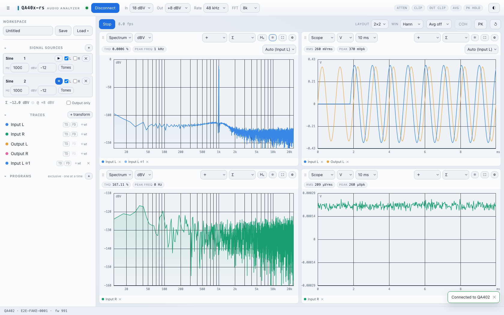
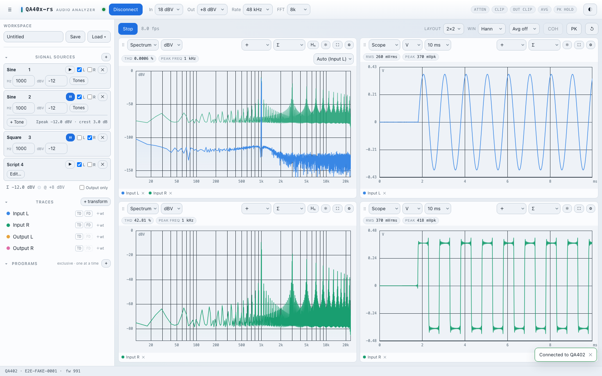
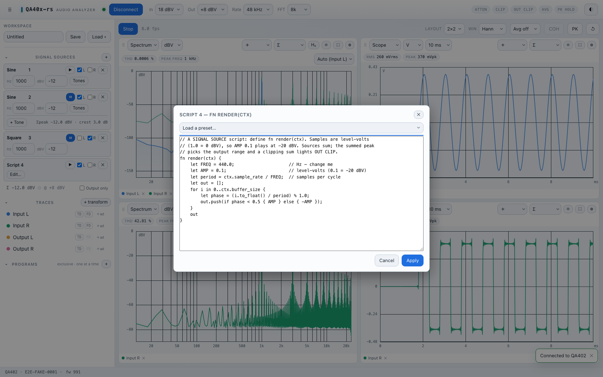
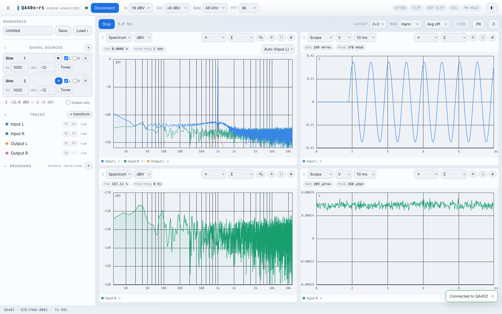

# Screenshots

`overview.png` is the hero shot in the top-level README — a real capture of the
running app (2×2 grid: spectrum, oscilloscope, THD-vs-frequency and
frequency-response sweeps). The device serial in its status bar is the
anonymised placeholder `AB12_CD34`.

The other images are **generated, not hand-taken**: the e2e screenshot tour
drives the real frontend through the test harness and writes PNGs to
`tests/e2e/screenshots/`. Regenerate after any UI change, then copy the ones
you want here:

```sh
npx playwright test tests/e2e/screenshot.pw.ts   # → tests/e2e/screenshots/*.png
```

| Preview | File | What it shows |
| --- | --- | --- |
|  | `overview.png` | The full app: 2×2 grid, signal sources, trace pool, measurement programs. |
|  | `grid-2x2.png` | A 2×2 layout of spectrum and oscilloscope tiles with two live sine traces. |
|  | `sources-panel.png` | The signal-sources panel: sine + square + script sources summed into the output. |
|  | `script-dialog.png` | The in-app Rhai script editor for a code-defined signal source. |
|  | `spectrum-live.png` | A single live spectrum tile with the measurement readout chips. |

## Honesty

This is a measurement instrument, so the generated shots hold to a rule: every
visible measurement (spectrum, level, THD number) comes from **replaying real
recorded QA402 loopback captures** (`tests/e2e/fixtures/`), run through the
app's own analysis path. Shots of pure UI structure (dialogs, an idle
dashboard) use the harness's synthetic backend and show no measured data. The
fake backend reports a placeholder serial (`E2E-FAKE-0001`), so no real device
identity appears in any generated image.
